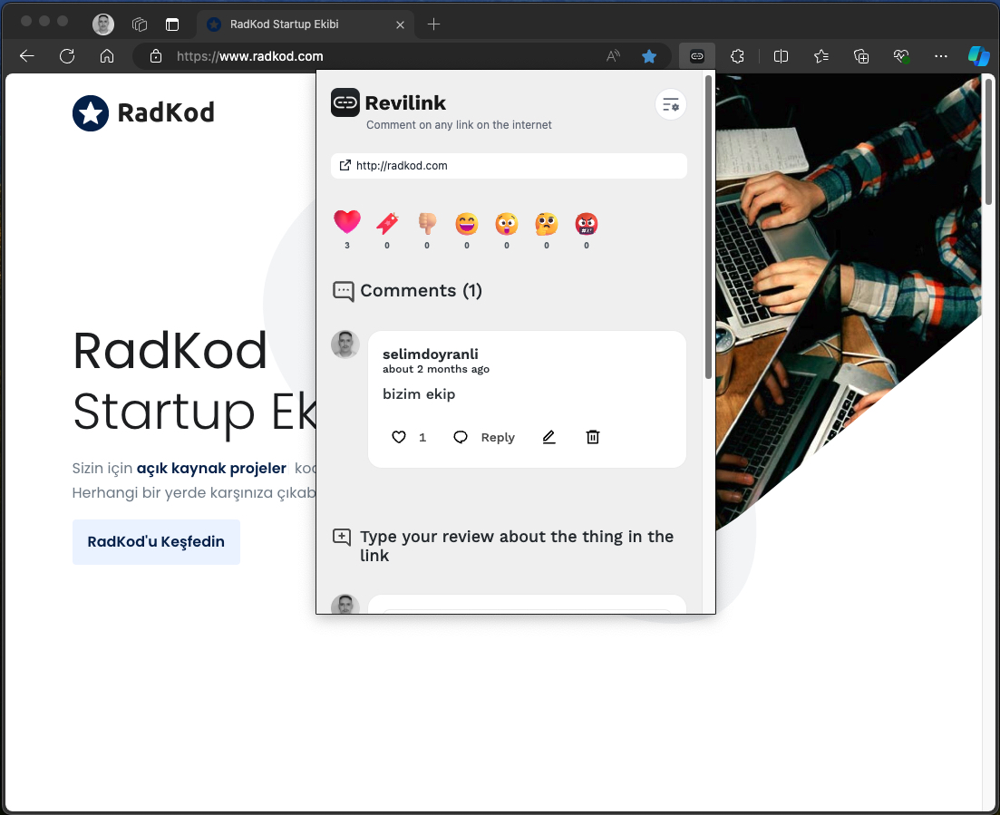

# Revilink Webext

<br>

<br>
<p align="center">
<a href="https://revilink.io" target="_blank">

</a>
</p>

<p align="center">
<b>Revilink Webext</b>
</p>

<p align="center">
Comment on any link on the internet
</p>

<br>

<br>
<p align="center">

</p>

<p align="center">
<a href="https://github.com/revilink/revilink-webext" target="__blank"></a>
</p>

<p align="center">
  <a href="https://revilink.io" target="_blank">Website</a>
</p>

<p align="center">
  <a href="https://chrome.google.com/webstore/detail/nliahkpjhgbbfgdlhanfcemeckbpbffd" target="_blank">
    
  </a>
</p>

<div align="center">
<sub>Buy me a coffee - <a href="https://www.buymeacoffee.com/selimdoyranli">Sponsorship 💖</a></sub><br>
<sub>Github Sponsors - <a href="https://github.com/sponsors/selimdoyranli">Sponsorship 💖</a></sub><br>
</div>

## Getting Started

### Init Project Locally

Install [Node.js >=18.18.0](https://nodejs.org/) and run the following command:

&nbsp;

#### Installation

Git clone.

```bash
$ git clone https://github.com/revilink/revilink-webext.git
```

&nbsp;

#### Build Setup

### Development

```bash
pnpm dev
```

Then **load extension in browser with the `extension/` folder**.

For Firefox developers, you can run the following command instead:

```bash
pnpm start:firefox
```

`web-ext` auto reload the extension when `extension/` files changed.

> While Vite handles HMR automatically in the most of the case, [Extensions Reloader](https://chrome.google.com/webstore/detail/fimgfedafeadlieiabdeeaodndnlbhid) is still recommanded for cleaner hard reloading.

## Using Gitpod

If you have a web browser, you can get a fully pre-configured development environment with one click:

[](https://gitpod.io/#https://github.com/revilink/revilink-webext)

### Build

To build the extension, run

```bash
pnpm build
```

And then pack files under `extension`, you can upload `extension.crx` or `extension.xpi` to appropriate extension store.

---

Based on <a href="https://github.com/antfu-collective/vitesse-webext">vitesse-webext</a>

## Sponsorship

You can sponsor me for the continuity of my projects:

<p align="left">
  <a href="https://buymeacoffee.com/selimdoyranli">
    
  </a>
</p>

## License

MIT License © 2024 [Revilink](https://github.com/revilink/revilink-webext)
